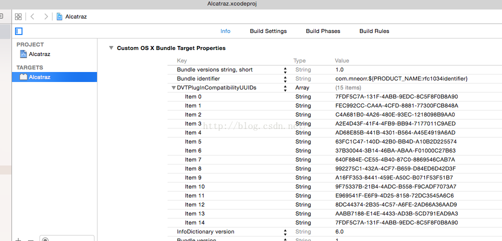

Xcode安装 Alcatraz PackageManager

有时还需要先删除原插件
rm -rf ~/Library/Application\ Support/Developer/Shared/Xcode/Plug-ins/Alcatraz.xcplugin

# 现象一、 运行安装后，没有出现在菜单上。

1. 到githup上下载Alcatraz project https://github.com/supermarin/Alcatraz
2. 打开终端
3. 输入

  defaults read /Applications/Xcode.app/Contents/Info DVTPlugInCompatibilityUUID
4. 得到当前的UUID
5. 打开下载的Alcatraz project
6. 在这个工程的infos设置里添加



注:若此时运行出错，提示信息如(这个路径是你自己工程提示错误路径)
```
/Users/WARRON/Library/Application Support/Developer/Shared/Xcode/Plug-ins/Alcatraz.xcplugin: Permission denied
```
这是由于没有权限
执行下面这段代码( 要去掉提示信息中 /Alcatraz.xcplugin: Permission denied 这一部分)
```
sudo chmod -R 777  /Users/WARRON/Library/Application\ Support/Developer/Shared/Xcode/Plug-ins
 

```

#现象二、看到提示


如果你选择了skip Bundles，那么你就算重新安装也不会看到了。

这是因为 XCode里面的黑名单机制

打开终端 输入
```
defaults delete com.apple.dt.Xcode DVTPlugInManagerNonApplePlugIns-Xcode-6.4 


```
再重启XCode，
这次看到上面的提示再选择Load Bundles

就可以了。


xcode8插件还需要这个稳定 http://www.tuicool.com/articles/MbEjqam 运行后，在dock中有个红帽子，然后右键 在finder 中显示，关闭xcode后再打开finder中的红帽子， 将应用z程序中的xcode直接拖入框框中即可
xcode8插件还需要这个不稳定 http://www.jianshu.com/p/dc2fc2a680fc
